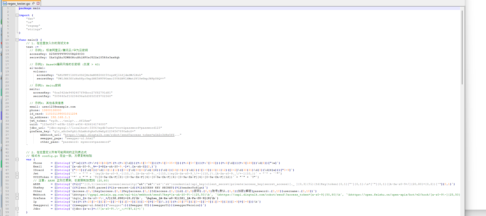
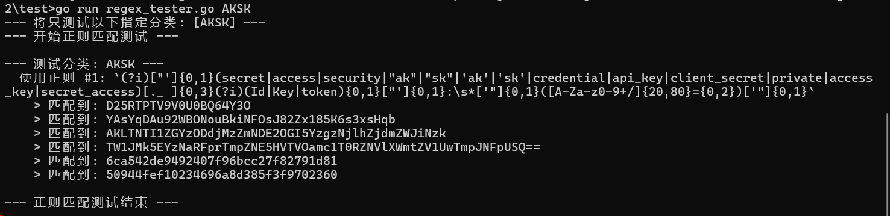

# URLFinder - 智能URL与敏感信息发现工具

`URLFinder` 是一款使用 Go 语言编写的高性能网络爬虫和安全侦察工具，专为渗透测试人员、安全研究员和代码审计人员设计。它能深度爬取目标网站，智能发现隐藏的URL、API接口，并能从前端代码（特别是JavaScript文件）中精准地提取各类高价值的敏感信息。

---

## 核心功能

- **智能URL发现**: 不仅仅是抓取 `<a>` 标签，还能从JavaScript代码、字符串拼接、配置文件等多种来源中发现URL。

- **高级模糊测试 (Fuzzing)**: 内置 `jsFuzz` 和 `urlFuzz` 模块，能够通过猜测和构造来发现未直接链接的隐藏路径和资源。

- **强大的敏感信息提取**: 内置了数十种高精度正则表达式，专注于发现硬编码在前端代码中的高价值信息，包括：
  
  - **访问凭证**: AccessKey/SecretKey (AK/SK), API Keys, Tokens
  - **身份认证**: JWT (JSON Web Tokens), UUID Tokens
  - **个人信息**: 手机号码, 邮箱地址, 身份证号码
  - **服务凭证**: Webhook地址 (钉钉, 飞书, 企业微信, Slack), Grafana密钥, 数据库连接字符串 (JDBC)
  - **其他线索**: IP地址, Swagger接口文档, 内部代码注释等
  
- **灵活的配置**: 通过 `config.yaml` 文件，可以轻松自定义请求头、代理、并发数、超时时间、扫描深度以及黑白名单等。

- **多种报告格式**: 扫描结果会自动保存在 `reports/` 目录下，并同时生成 `.html`, `.json`, 和 `.csv` 三种格式的报告，以适应不同分析场景的需求。

- **高性能**: 基于Go语言的并发特性，能够实现快速、高效的扫描。

  

  原项目

  https://github.com/pingc0y/URLFinder

---

## 安装与编译

1.  **克隆项目**
    ```bash
    git clone [项目仓库地址]
    cd URLFinder
    ```

2.  **安装依赖**
    ```bash
    go mod tidy
    ```

3.  **编译项目**
    ```bash
    go build
    ```
    编译成功后，当前目录下会生成可执行文件 `URLFinder.exe` (Windows) 或 `URLFinder (Linux/macOS)。

---

## 使用方法

1.  **通过 `url.txt` 文件**
    - 将需要扫描的目标URL（每行一个）填入项目根目录下的 `url.txt` 文件。
    - 直接运行程序：
      ```bash
      URLFinder.exe -i  -f url.txt -m 3 -s all -o report 
      ```

2.  **通过命令行参数**
    - 使用 `-u` 参数指定单个目标URL进行扫描。
      ```bash
      ./URLFinder-huaimeng -i -u http://example.com
      ```

---

## 配置文件 (`config.yaml`)

- 如果项目根目录下不存在 `config.yaml`，程序在首次运行时会自动创建一份默认的配置文件。
- 您可以修改此文件来自定义扫描行为，例如：
  - `thread`: 并发线程数。程序会根据此值动态调整并发能力，请根据您的机器性能和网络状况设置一个合理的值。
  - `timeout`: 请求超时时间
  - `proxy`: 设置HTTP代理
  - `headers`: 自定义请求头，例如添加`Cookie`进行身份认证扫描
  - `JsFiler`, `UrlFiler`: 配置URL黑名单，过滤掉不需要扫描的路径。

---

## 优化与改进记录

本工具在初始版本的基础上，进行了一系列旨在提升**准确性**、**健壮性**和**可用性**的核心功能优化。

### 1. 自定义敏感信息正则 (v0.1)
- **问题**:
  - 原版本将敏感信息的正则表达式硬编码在程序中，用户无法根据自己的需求灵活地添加、修改或删除规则。
- **解决方案**:
  - 对配置加载逻辑进行了重构。现在，所有的敏感信息匹配规则（如`AKSK`, `Email`, `Phone`等）都已外置到 `config.yaml` 文件中。
  - 用户可以直接编辑 `config.yaml` 的 `infoFind` 部分，为任意一个类别（如`Phone`）添加新的正则表达式，或者创建全新的类别和规则，实现了完全的自定义和可扩展性。

### 2. 扩展敏感信息规则库 (v0.1)
- **问题**:
  - 原版内置的正则规则较少，仅能覆盖几种常见的个人信息。
- **解决方案**:
  - 极大地扩展了默认的敏感信息规则库，新增了对 `AK/SK`, `UUID Token`, `Webhook`, `Grafana密钥`, `数据库连接字符串(JDBC)` 等8种以上高价值目标的检测能力，使工具的发现范围和实战价值得到质的提升。

### 3. 敏感信息报告逻辑重构 (v0.1)
- **问题**:
  - 原版在生成报告时，为每一种敏感信息（如手机、邮箱）都编写了独立的、重复的输出代码，导致代码冗长且难以维护和扩展。
- **解决方案**:
  - 对敏感信息的存储结构（`mode.Info`）和报告生成函数（如`OutFileCsv`, `Print`）进行了彻底重构。新的设计采用统一的键值对（Key-Matches）来存储所有类型的发现，并使用一段通用的循环逻辑来生成报告。
- **价值**:
  - 此项重构不仅减少了超过80%的重复代码，还极大地提升了程序的可扩展性。现在，当新增一种敏感信息规则时，开发者不再需要修改任何报告相关的代码，程序会自动适应并正确输出新类型的结果。

### 4. 邮箱发现功能优化 (v0.1)
- **问题**:
  1.  **漏报**: 最初的正则只能匹配到位于行首的邮箱，导致遗漏大量硬编码在代码中间的邮箱地址。
  2.  **误报**: 简单的正则无法区分真实的邮箱和格式碰巧类似邮箱的普通字符串。
- **解决方案**:
  1.  **修正正则**: 去掉了正则表达式中的行首限定符 (`^`)，确保能发现所有位置的潜在邮箱。
  2.  **引入二次验证**: 在 `crawler/find.go` 中，对所有正则匹配到的结果，引入Go标准库 `net/mail` 进行权威的RFC格式校验，只有通过校验的才被认定为有效邮箱，极大地降低了误报率。

### 5. IP地址发现功能优化 (v0.1)
- **问题**:
  1.  **误报**: 工具会将某些加密算法的OID常量（如`2.16.840.1.101.3.4.1.42`）错误地识别为IP地址。
  2.  **代码健壮性**: 原有的IP地址过滤逻辑为自定义实现，不够专业和全面。
- **解决方案**:
  1.  **重构验证函数**: 在 `crawler/find.go` 中，重写了 `isLikelyRealIP` 函数。新函数使用标准库 `net.ParseIP` 进行格式验证，并用 `ip.IsUnspecified()` 等标准方法替代了手写的过滤规则，使代码更健壮、意图更清晰。
  2.  **更新黑名单**: 根据实际案例，在OID过滤列表中加入了新的前缀，以精确屏蔽由加密常量导致的误报。

### 6. 正则表达式健壮性修复 (v0.1)
- **问题**:
  - 程序中部分用于解析HTML的正则表达式存在语法缺陷，在遇到特定边缘情况时可能导致程序崩溃。
- **解决方案**:
  - 全面审查并修正了这些存在缺陷的正则表达式，通过使用反引号定义等方式，避免了特殊字符的转义问题，提升了爬虫的稳定性。

### 7. 敏感信息报告去重 (v0.1)
- **问题**:
  - 如果同一个文件中多次出现相同的敏感信息（如同一个IP或同一个密钥特征），报告中会产生大量重复条目，干扰核心信息的提取。
- **解决方案**:
  - 在 `crawler/find.go` 的 `infoFind` 函数中，实现了一套精确的去重逻辑。该逻辑会以【来源文件名】和【具体匹配到的值】作为联合键，确保**任何一个具体的值在同一个文件中只被报告一次**，显著提升了报告的信噪比和可用性。

### 8. URL及JS链接去重优化 (v0.1)
- **问题**:
  - 在对大型网站进行扫描时，经常会发现大量指向相同内容的URL（例如，多个API接口返回大小和内容都一致的JSON数据），导致最终报告中存在大量冗余信息，难以分析。
- **解决方案**:
  - 在 `crawler/state.go` 中，引入了一套全新的、基于结果属性的去重机制。
  - **去重策略**: 程序不再使用对内容极其敏感的MD5哈希校验，而是根据 **`状态码(Status) + 响应大小(Size) + 页面标题(Title)`** 这三个核心字段组合成一个唯一键。
  - **实现效果**: 只有当一个URL或JS的这三个属性组合是第一次出现时，它才会被记录。这能有效过滤掉所有内容实质上等价的重复链接，同时又保留了被标记为“疑似危险路由”的URL（因为它们的处理逻辑被刻意绕过了去重），极大地提升了报告的清晰度和可用性。

### 9. 新增正则测试代码 (v0.2)

- **问题**:
  
  - 网上很多正则容易误报。
- **解决方案**:

  - 新增 `test/regex_tester.go` 中，可以自定义敏感信息和正则表达式测试。

    

    

### 10. 核心功能优化 (v0.3)

- **问题**:
  1. **基本路径解析不完整**: 原版本仅通过相对路径和当前URL进行拼接，未考虑HTML中 `<base>` 标签或JS中 `baseUrl` 变量对路径的影响，导致URL解析不准。
  2. **缺少Referer头**: 发送请求时未携带 `Referer`，可能导致无法访问有防盗链机制的网站。
  3. **URL解码错误**: `url.QueryUnescape` 函数在遇到无效编码时会返回空字符串，且未处理该错误，导致链接丢失。
- **解决方案**:
  1. **增强基本URL检测**: 在 `crawler/crawler.go` 中，新增了对HTML中 `<base href="...">` 标签以及JS中 `base:"..."`, `baseUrl:"..."` 等变量的提取逻辑，使相对路径的解析更加精准。
  2. **自动添加Referer**: 程序现在会自动将来源页面的URL作为 `Referer` 添加到HTTP请求头中，提升了抓取成功率。
  3. **修复URL解码问题**: 在 `crawler/filter.go` 中，增加了对 `url.QueryUnescape` 函数错误的检查。如果解码失败，将回退使用原始URL，确保链接不会丢失。

### 11. 并发稳定性修复 (v0.4)

- **问题**:
  - 在对大型网站进行高并发扫描时，程序有几率因并发读写共享数据而崩溃，并抛出 `fatal error: concurrent map read and map write` 致命错误。
- **解决方案**:
  - 对代码进行了全面的并发安全审查。定位到在 `crawler/crawler.go` 中存在一处对共享地图资源的读取操作未受互斥锁保护。
  - 通过为该读取操作添加与写入方一致的 `config.Lock` 互斥锁，彻底修复了此数据竞争问题，显著提升了程序在高负载下的健壮性和稳定性。

---

## 许可

请参阅 `LICENSE` 文件了解详情。

---

## 免责声明

本工具仅限于授权安全测试和安全研究目的。严禁用于任何非法活动。

使用本工具即表示您同意，对于因非法使用本工具而导致的一切直接或间接后果，您将承担全部法律及连带责任，开发者不承担任何法律及相关责任。

请在遵守您当地法律法规的前提下使用本工具。